# PROJETO-PI-DIGITAL-HOUSE
Projeto integrador

Baseado em um e-commerce

Durante nosso envolvimento em um projeto de e-commerce, fomos responsável por desenvolver uma aplicação web robusta utilizando tecnologias chave como Node.js para o backend, CSS e HTML para o design responsivo, e MySQL como banco de dados.

Tecnologias Utilizadas:

Node.js: Implementamos o backend da aplicação utilizando Node.js, explorando seu ambiente assíncrono para otimizar o desempenho da aplicação. Utilizei o framework Express para facilitar o roteamento e a criação de APIs RESTful.

CSS e HTML: Trabalhamos na criação de um layout atraente e responsivo, utilizando CSS para estilizar as páginas e HTML para a estruturação do conteúdo. Garantimos uma experiência do usuário intuitiva, focando na usabilidade e na interface amigável.

MySQL: Gerencimos o banco de dados MySQL para armazenar eficientemente informações sobre produtos, usuários e transações. Utilizei consultas SQL otimizadas para garantir a integridade e a segurança dos dados.

Funcionalidades Principais:

Cadastro de Produtos e Usuários: Desenvolvemos funcionalidades para permitir o cadastro de novos produtos, bem como a criação de contas de usuário, proporcionando uma experiência personalizada.

Processamento de Compras: Criamos um precessamento de conclusçãp de compra.

Painel Administrativo: Desenvolvemos um painel administrativo intuitivo, permitindo a gestão eficiente de produtos e usuários, proporcionando controle sobre o e-commerce.

Desafios Superados:

Enfrentamos desafios como a otimização de consultas SQL para lidar com grandes volumes de dados, a implementação de autenticação segura de usuários e funcionalidades específicas.

Conclusão:

Meu envolvimento neste projeto de e-commerce não apenas aprimorou minhas habilidades em desenvolvimento web, mas também me permitiu enfrentar desafios complexos e aprender a equilibrar eficiência e segurança. Estou entusiasmado para aplicar essas experiências em futuros projetos e continuar aprimorando minhas habilidades no desenvolvimento web.

Fotos do projeto:

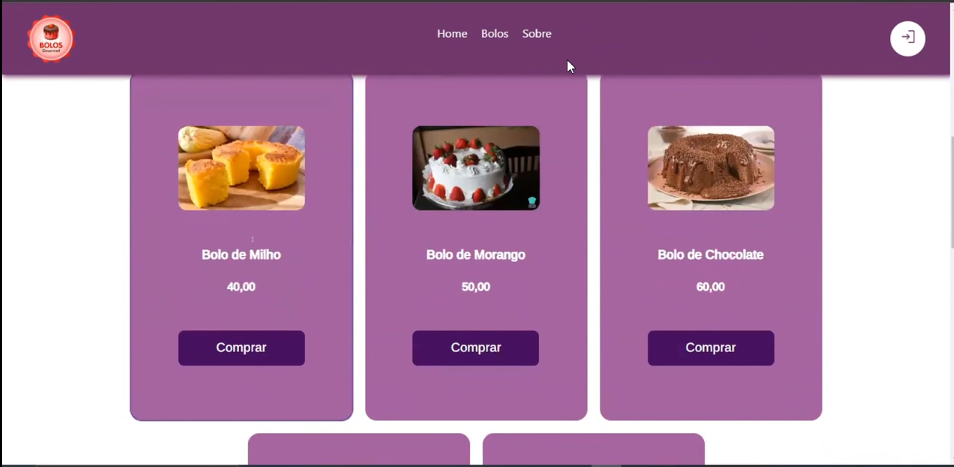
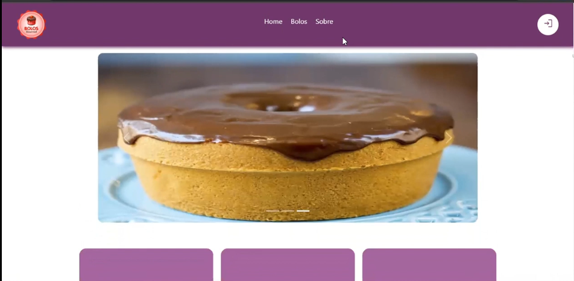
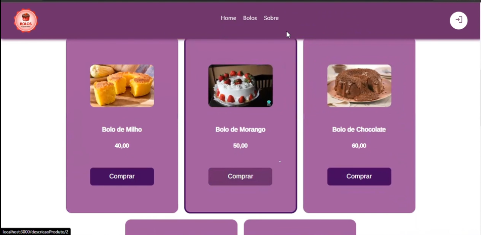
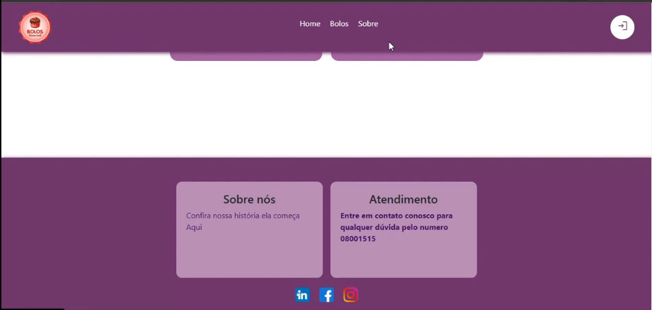
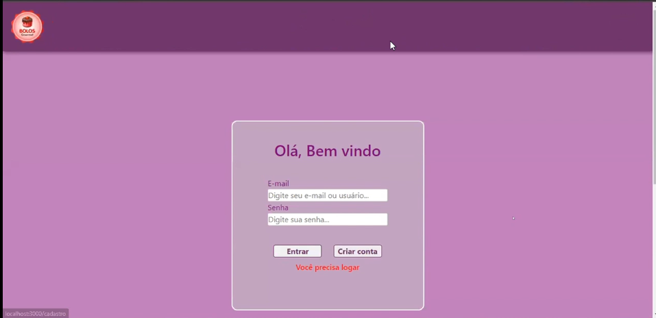
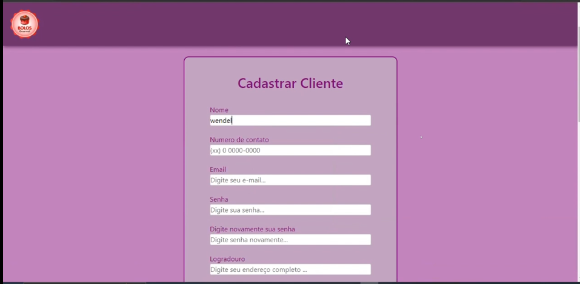
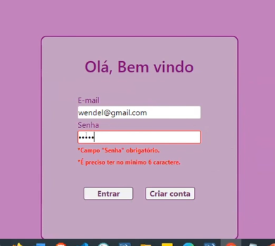
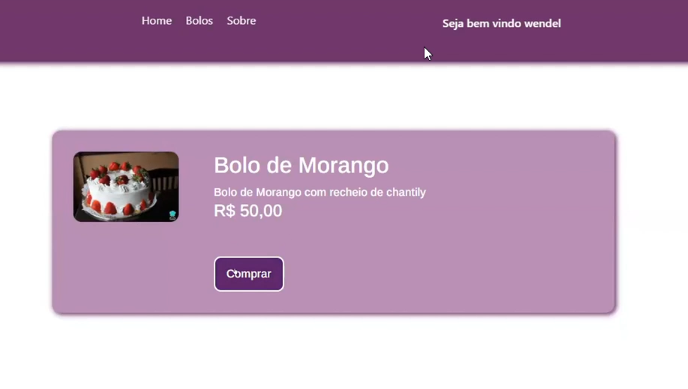
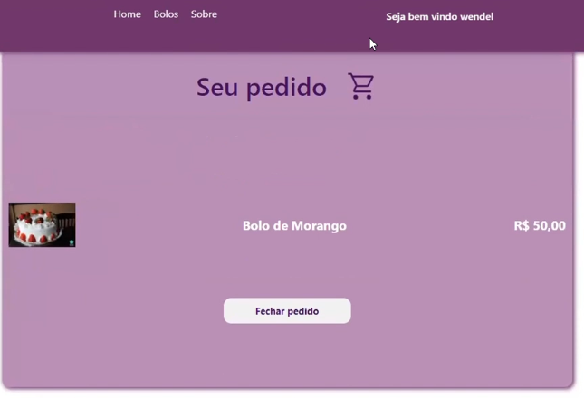
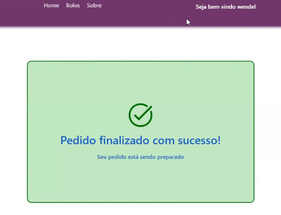
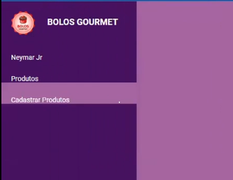
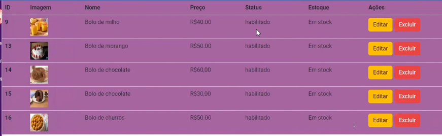
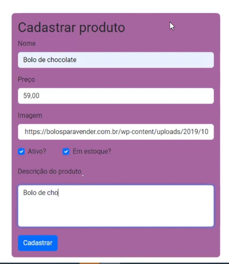

